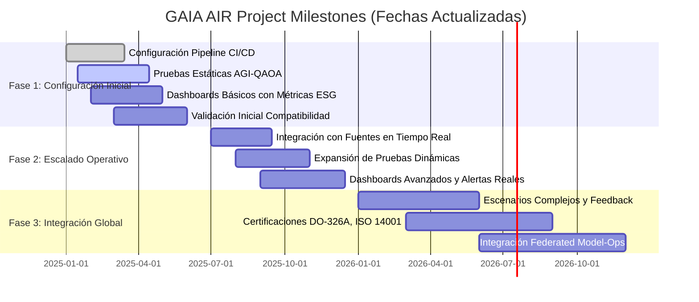
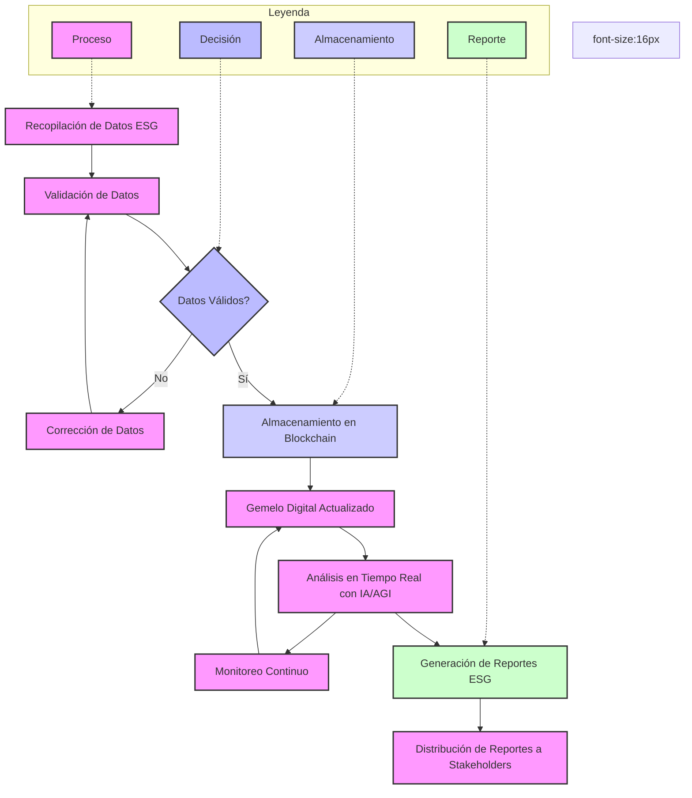

# GAIA-DS-GAIA-AIR-WelcomeNote.md

Below is the final integrated welcome note (`welcomeNOTE.md`) that consolidates the entire GAIA DS concept and includes references to the GAIA AIR Mermaid diagrams, the SRS outline, and the ATA JASC index explanation as discussed. All code blocks and references are properly closed, and the text is structured for clarity and completeness.

---

**File:** `welcomeNOTE.md`

```markdown
# Welcome to GAIA DS

---

## GAIA DS: Un Marco Holístico y Sostenible

**Definición:**  
GAIA DS (GAIA Desarrollo Sostenible / GAIA Sustainable Development) es un marco pionero diseñado para abordar desafíos complejos e interconectados en sectores como la aeronáutica, la sostenibilidad, la energía, la defensa, la informática y la colaboración interinstitucional. Concebido por Amedeo Pelliccia, GAIA DS trasciende los límites tradicionales de los proyectos para adoptar un enfoque de sistemas-de-sistemas, combinando innovación tecnológica, responsabilidad ambiental y compromiso social.

---

### Atributos Clave de GAIA DS

1. **Multiescalar:**  
   GAIA DS opera en múltiples escalas, desde nano-estructuras y materiales avanzados hasta metas globales de sostenibilidad. Integra impactos comunitarios, consideraciones regionales, normativas nacionales y objetivos climáticos internacionales.

2. **Multidimensional:**  
   GAIA DS abarca diversas dimensiones:  
   - **Técnica:** Propulsión híbrida, motores MHD DIFFUSP, IA/AGI, QAOA, gemelos digitales, IoT.  
   - **Ambiental:** Economía circular, reducción de carbono, minimización de residuos, alta reciclabilidad.  
   - **Económica:** Eficiencia de costes, ahorro operativo, cadenas de suministro estables, competitividad.  
   - **Social:** Ética, participación comunitaria, desarrollo de la fuerza laboral, colaboración con universidades y ONG.

3. **Multi-Objetivo:**  
   GAIA DS persigue objetivos múltiples y a menudo competitivos:  
   - Reducción de emisiones de carbono (≥80% para 2050)  
   - Eficiencia energética (Mejora MTBF)  
   - Economía circular (≥90% reciclabilidad)  
   - Cumplimiento normativo (EASA, FAA, ISO 14040, DO-326A)  
   - Innovación y responsabilidad social

4. **Multidominio:**  
   GAIA DS se extiende a múltiples dominios y subprogramas:  
   - **Aeroespacial (GAIA-AIR):** Propulsión híbrida, motores MHD DIFFUSP, materiales avanzados, aviación sostenible, gestión ESG.  
   - **Computación e IT (GAIA-COMPUTING-IT_PMOs):** HPC, ciberseguridad, blockchain, CI/CD.  
   - **Defensa y Seguridad (GAIA-DEFENCE):** Comunicaciones seguras, criptografía cuántico-segura.  
   - **Espacio (GAIA-SPACE):** Metodologías extendidas a plataformas orbitales.  
   - **Sostenibilidad Inter-Agencias (GAIA-SUSTAINABILITY-CROSS-AGENCY):** Armonización de políticas medioambientales.

5. **Multi-Componentes y Multi-Actores:**  
   GAIA DS coordina iniciativas en propulsión, gestión energética (IA/AGI, QAOA), mantenimiento predictivo, economía circular (DfD, blockchain), seguridad (AES-256, DO-326A).

6. **Multi-Programa & Multi-Proyecto:**  
   GAIA DS integra proyectos (GAIA AIR, GAIA SPACE, GAIA DEFENCE), I+D con universidades, y funciones TI/PMO, alineando metas sostenibles e innovadoras.

**Activadores Maestros:** Cambios regulatorios, avances tecnológicos (H₂, QAOA, composites), feedback de stakeholders, indicadores ambientales, ciclos ágiles (CI/CD).

**Gobernanza e Integración:**  
- **PROS (Project Structure)**  
- **PRBS (Product Breakdown Structure)**  
- **SPLR-GAIA Quantum Portal** (IA/AGI, QAOA, monitoreo, ciberseguridad)  
- **DOS (Design Office Structure)**  
- **ReFrame (Research Framework)**

**Validación, Verificación y Mejora Continua:** Pruebas rigurosas (banco, CFD/EM), auditorías externas, mejora continua, documentación S1000D, formación robusta.

**Conclusión GAIA DS:**  
GAIA DS, según Amedeo Pelliccia, es un ecosistema holístico que impulsa la sostenibilidad e innovación aeroespacial, alineando objetivos ambientales, avances tecnológicos, economía circular y cumplimiento normativo. Prepara el camino hacia una industria aeroespacial más limpia, eficiente, resiliente y globalmente conectada.

---

## GAIA AIR - Diagramas Mermaid

**Descripción:**  
Este apartado incluye diagramas Mermaid para GAIA AIR, dando soporte a la toma de decisiones, gestión ESG y transparencia operativa.

### Diagrama Gantt - Milestones del Proyecto GAIA AIR (Fechas Actualizadas)

**Descripción:** Muestra fases del proyecto GAIA AIR, hitos, progresos y dependencias.



### Diagrama de Flujo - Trazabilidad ESG

**Descripción:** Ilustra gestión de datos ESG: recolección, validación, blockchain, gemelos digitales, análisis IA/AGI, reportes ESG.



**Notas:**  
- Cierre de bloques: triple backticks en cada bloque de código.  
- Ajuste de aspect ratio en la plataforma de renderizado.  
- Fuente 16px para legibilidad.  
- Requiere soporte Mermaid (Docsify, Asciidoctor, etc.).

Estas medidas mejoran la experiencia visual y mantenibilidad de diagramas GAIA AIR.

---

## Ampliando GAIA DS

- **Computing & IT (GAIA-COMPUTING-IT_PMOs):** HPC, ciberseguridad, blockchain, CI/CD.  
- **Defensa & Seguridad (GAIA-DEFENCE):** Comunicaciones seguras, criptografía cuántico-segura.  
- **Espacio (GAIA-SPACE):** Plataformas orbitales, satélites, logística interplanetaria.  
- **Sostenibilidad Inter-Agencias (GAIA-SUSTAINABILITY-CROSS-AGENCY):** Armonización políticas ambientales.

Integración Multi-Program & Multi-Project: I+D con universidades, estrategias de mercado (GAIA-INTERCONNECTED-PROGRAMS), TI/PMO alineados con sostenibilidad.

Master Triggers & Governance: Cambios regulatorios, avances tecnológicos, feedback mercado, indicadores ambientales, innovación ágil. PROS, PRBS, SPLR-GAIA Quantum Portal, DOS, ReFrame aseguran roles claros, metodologías y adaptabilidad.

---

## Especificación de Requisitos del Sistema (SRS) - GAIA DS

**Contexto SRS:** Avión Largo Alcance Alta Capacidad Híbrido con Motor DIFFUSP MHD, en línea con GAIA DS.  
En el SRS se detallan objetivos, alcance, requisitos funcionales y no funcionales, cumplimiento normativo, economía circular, seguridad, IA/AGI, QAOA, gemelos digitales, blockchain y ciberseguridad.

**Indices ATA JASC:**  
Se presentará un índice ATA JASC 8-Dígitos adaptado para GAIA AIR, detallando sistemas, sub-sistemas y componentes con códigos y descripciones para gestión eficiente.

**Descripción de Campos ATA JASC:**  
- System_Code, JASC_Code, Title, Description, Page_Number, CLASS_CATEGORY, DEEPLEVEL, DMC_DOMAIN_DESC, ASSIGNABLE_ATAXX_XX_XX_DESC, VERSION_MODEL, TYPE.

Este SRS provee una base para validación, verificación, gestión de riesgos, actualizaciones, auditorías externas (EASA, FAA, ISO), mejora continua y escalabilidad futura.

---

## Conclusión Final

GAIA DS, alineado con la visión de Amedeo Pelliccia, representa un ecosistema complejo, interconectado y evolutivo. Integra la sostenibilidad, innovación, economía circular, IA/AGI, QAOA, ciberseguridad, normativas internacionales y colaboración multi-actor. Las herramientas (PROS, PRBS, SPLR, DOS, ReFrame), diagramas Mermaid (Gantt, ESG), y el SRS detallado conforman un marco robusto.

Esta documentación establece cimientos sólidos para el avance en el desarrollo aeroespacial, cumpliendo con exigencias ambientales, tecnológicas y sociales, y orientando a la industria hacia un futuro más limpio, eficiente y resiliente.

---

**End of welcomeNOTE.md**
```

---

This final `welcomeNOTE.md` provides a cohesive introduction to GAIA DS, includes references to the GAIA AIR Mermaid diagrams, outlines the SRS and ATA JASC index context, and integrates all previous feedback and content into a single, coherent, and well-structured document.
