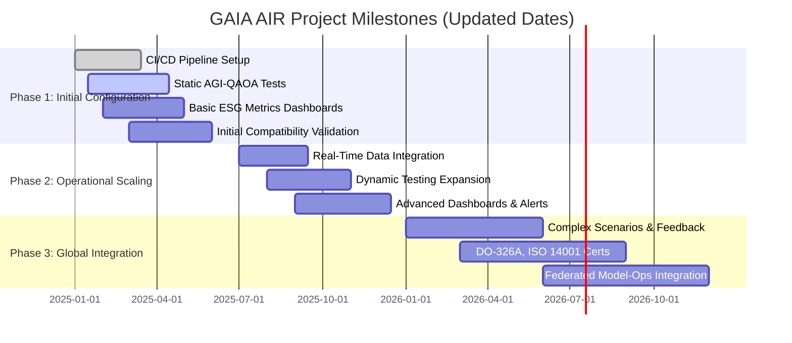

## GAIA DS: A Holistic and Sustainable Framework

**Definition:**  
GAIA DS (GAIA Sustainable Development) is a pioneering framework designed to address complex and interconnected challenges in sectors such as aerospace, sustainability, energy, defense, computing, and inter-agency collaboration. Envisioned by Amedeo Pelliccia, GAIA DS transcends traditional project boundaries, adopting a systems-of-systems approach that merges technological innovation, environmental stewardship, and social responsibility.

---

### Key Attributes of GAIA DS

1. **Multiscale:**  
   GAIA DS operates across multiple scales—from nano-structured materials and advanced composites at the microscopic level to alignment with global regulatory and sustainability targets. It addresses community-level impacts, regional supply chain considerations, national regulatory standards, and international climate objectives simultaneously.

2. **Multidimensional:**  
   GAIA DS spans various dimensions:
   - **Technical:** Hybrid propulsion, DIFFUSP MHD engines, AI/AGI, QAOA, digital twins, IoT.  
   - **Environmental:** Circular economy, carbon reduction, waste minimization, high recyclability.  
   - **Economic:** Cost-effectiveness, long-term operational savings, stable supply chains, market competitiveness.  
   - **Social:** Ethical practices, community engagement, workforce development, transparency, academic and NGO collaboration.

3. **Multi-Objective:**  
   GAIA DS targets multiple, often competing objectives:
   - Carbon emission reductions (≥80% by 2050)  
   - Energy efficiency & reliability (improved MTBF)  
   - Circular economy (≥90% recyclability of critical materials)  
   - Regulatory compliance (EASA, FAA, ISO 14040, DO-326A)  
   - Innovation and social responsibility

4. **Multidomain:**  
   GAIA DS extends across multiple domains and subprograms:
   - **Aerospace (GAIA-AIR):** Hybrid propulsion, DIFFUSP MHD engines, advanced materials, sustainable aviation, ESG management.  
   - **Computing & IT (GAIA-COMPUTING-IT_PMOs):** HPC, cybersecurity, blockchain, CI/CD.  
   - **Defense & Security (GAIA-DEFENCE):** Secure communications, quantum-safe cryptography, resilient systems.  
   - **Space (GAIA-SPACE):** Methodologies extended to orbital platforms, satellites, interplanetary logistics.  
   - **Cross-Agency Sustainability (GAIA-SUSTAINABILITY-CROSS-AGENCY):** Harmonization of environmental policies and standards.

5. **Multi-Component & Multi-Stakeholder:**  
   GAIA DS coordinates initiatives in propulsion (electric, hydrogen, solid-state batteries, DIFFUSP MHD), energy management (AI/AGI, QAOA, IoT sensors, digital twins), predictive maintenance, circular economy (DfD, blockchain traceability), and security (AES-256, MFA, DO-326A).

6. **Multi-Program & Multi-Project:**  
   GAIA DS integrates projects (GAIA AIR, GAIA SPACE, GAIA DEFENCE), R&D with universities, and IT/PMO functions to align with sustainable innovation goals.

**Master Triggers:** Regulatory shifts, technological breakthroughs (hydrogen, QAOA, composites), market & stakeholder feedback, environmental indicators, agile innovation cycles (CI/CD).

**Governance & Integration:**  
- **PROS (Project Structure)**  
- **PRBS (Product Breakdown Structure)**  
- **SPLR-GAIA Quantum Portal** (AI/AGI, QAOA, real-time monitoring, cybersecurity, quantum computing)  
- **DOS (Design Office Structure)**  
- **ReFrame (Research Framework)**

**Validation, Verification & Continuous Improvement:** Rigorous testing (bench, CFD/EM), external audits (EASA, FAA, ISO), continuous improvement loops, transparent documentation (S1000D), robust training.

**Conclusion GAIA DS:**  
GAIA DS, as envisioned by Amedeo Pelliccia, is an advanced ecosystem that drives aerospace sustainability and innovation. By aligning environmental goals, technological advancement, circular economy principles, and regulatory compliance, GAIA DS sets the stage for a cleaner, more efficient, resilient, and globally connected aerospace industry.

---

## GAIA AIR - Mermaid Diagrams

**Description:**  
This section includes Mermaid diagrams for GAIA AIR, supporting decision-making, ESG data management, and operational transparency.

### Gantt Diagram - GAIA AIR Project Milestones (Updated Dates)

**Description:**  
Shows project phases, milestones, progress, and dependencies.



### ESG Traceability Flowchart

**Description:**  
Illustrates ESG data handling in GAIA AIR: collection, validation, blockchain storage, digital twins, AI/AGI analysis, and ESG reporting.

```mermaid
flowchart TD
    classDef process fill:#f9f,stroke:#333,stroke-width:2px,color:#000;font-size:16px;
    classDef decision fill:#bbf,stroke:#333,stroke-width:2px,color:#000;font-size:16px;
    classDef storage fill:#ccf,stroke:#333,stroke-width:2px,color:#000;font-size:16px;
    classDef report fill:#cfc,stroke:#333,stroke-width:2px,color:#000;font-size:16px;

    A[ESG Data Collection]:::process --> B[Data Validation]:::process
    B --> C{Valid Data?}:::decision
    C -->|Yes| D[Blockchain Storage]:::storage
    C -->|No| E[Data Correction]:::process --> B
    D --> F[Digital Twin Updated]:::process
    F --> G[Real-Time AI/AGI Analysis]:::process
    G --> H[ESG Report Generation]:::report
    H --> I[Report Distribution to Stakeholders]:::process
    G --> J[Continuous Monitoring]:::process
    J --> F

    classDef legend fill:#f0f0f0,stroke:#000,stroke-width:1px,color:#000;font-size:14px;
    subgraph Legend
        L1[Process]:::process
        L2[Decision]:::decision
        L3[Storage]:::storage
        L4[Report]:::report
    end
    L1 -.-> A
    L2 -.-> C
    L3 -.-> D
    L4 -.-> H
```

**Notes:**  
- Code block closure: triple backticks for each code block.  
- Aspect ratio: adjustable in the rendering platform.  
- Font size: 16px for improved readability.  
- Mermaid compatibility: ensure your environment (Docsify, Asciidoctor, etc.) supports Mermaid.

These measures enhance visual experience and maintainability of GAIA AIR diagrams.

---

## Expanding GAIA DS

- **Computing & IT (GAIA-COMPUTING-IT_PMOs):** HPC, cybersecurity, blockchain, CI/CD.  
- **Defense & Security (GAIA-DEFENCE):** Secure communications, quantum-safe cryptography, resilient systems.  
- **Space (GAIA-SPACE):** Orbital platforms, satellites, interplanetary logistics.  
- **Cross-Agency Sustainability (GAIA-SUSTAINABILITY-CROSS-AGENCY):** Harmonizing environmental policies and standards.

Multi-Program & Multi-Project Integration: R&D with universities, market strategies (GAIA-INTERCONNECTED-PROGRAMS), and IT/PMO ensuring alignment with sustainable, innovative objectives.

Master Triggers & Governance: Regulatory changes, technological advances, market feedback, environmental indicators, and agile innovation cycles guide actions. PROS, PRBS, SPLR-GAIA Quantum Portal, DOS, ReFrame ensure clarity, methodology, and adaptability.

---

## System Requirements Specification (SRS) - GAIA DS

**Context SRS:** Long-range, high-capacity hybrid aircraft with DIFFUSP MHD engines aligned with GAIA DS principles. The SRS details objectives, scope, functional/non-functional requirements, regulatory compliance, circular economy, security, AI/AGI, QAOA, digital twins, blockchain, and cybersecurity.

**ATA JASC Index:**  
An adapted 8-digit ATA JASC index for GAIA AIR systems, subsystems, and components to efficiently identify and manage each element.

**Field Descriptions (ATA JASC):**  
- System_Code, JASC_Code, Title, Description, Page_Number, CLASS_CATEGORY, DEEPLEVEL, DMC_DOMAIN_DESC, ASSIGNABLE_ATAXX_XX_XX_DESC, VERSION_MODEL, TYPE.

This SRS provides a foundation for validation, verification, risk management, updates, external audits (EASA, FAA, ISO), continuous improvement, and future scalability.

---

## Final Conclusion

GAIA DS, aligned with Amedeo Pelliccia’s vision, represents a complex, interconnected, and evolving ecosystem. Integrating sustainability, innovation, circular economy, AI/AGI, QAOA, cybersecurity, and international standards, GAIA DS redefines the aerospace industry toward a cleaner, more efficient, and resilient future.

This `welcomeNOTE.md` sets a coherent foundation for ongoing expansions, validations, stakeholder engagement, and continuous technological evolution within the GAIA DS framework.

---
